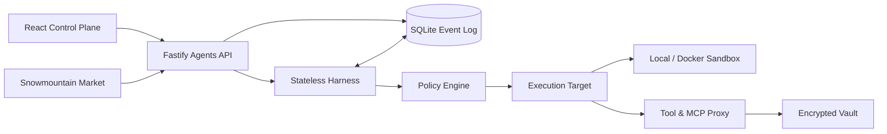

# 雪山方舟 · Snowmountain Ark

一个 Git-first 的 Managed Agents 控制面与运行时 Beta，借鉴火山方舟的资源模型，并按 Anthropic 的 Managed Agents / Auto Mode / Containment 经验重新组织内部边界。

目前已具备：

- Agent 版本、模型、System Prompt、Skills、Tools、Multi Agents、MCPs 与工具级权限；
- Session、Environment、Credentials Vault、Memory Store 与依赖删除保护；
- SQLite 追加事件日志，逐项记录 User、Thinking、Policy、Tool Use、Tool Result、Assistant 与状态；
- 同一 Session 跨任务持久的 `/workspace`；
- 本地开发 Sandbox 和 Docker 硬隔离驱动；
- OpenAI-compatible 模型端点与本地确定性 Harness；
- 雪山 Market catalog 对接；
- React 控制台、结构化事件 Inspector 和依赖图。

## 架构



核心原则是：Session 是持久事件与状态，不是某个容器或模型上下文；Harness 和 Sandbox 都可以独立失败、恢复和替换。

## 本地运行

要求 Node.js 24、pnpm 10。Docker 仅在启用 Docker Sandbox 时需要。

```bash
pnpm install
pnpm test
pnpm build
pnpm dev
```

- 控制台：`http://127.0.0.1:4311`
- API：`http://127.0.0.1:4310`
- 健康检查：`http://127.0.0.1:4310/health`

在相邻目录启动雪山 Market 后，Agent 创建页和 Market 页会自动读取：

```bash
cd ../snowmountain-market
pnpm install
pnpm dev
```

Catalog 默认地址：`http://127.0.0.1:4320/api/catalog.json`。

## Sandbox

开发模式默认使用 `SANDBOX_DRIVER=local`，它只提供工作区边界校验，不是安全隔离。运行不可信模型代码时必须使用 Docker：

```bash
SANDBOX_DRIVER=docker SANDBOX_IMAGE=alpine:3.20 pnpm dev:api
```

Docker 驱动按工具调用启动可替换容器，默认：

- `--network none`
- read-only 根文件系统 + 64 MiB 临时 `/tmp`
- `cap-drop ALL`
- `no-new-privileges`
- CPU、内存与 PID 限制
- 只将当前 Session 工作区挂载为 `/workspace`

域名 allowlist 只用于代理化的 `web_fetch`，不会给 Sandbox 开放任意网络。

## 接真实模型

创建 Agent 时选择 `OpenAI-compatible`，填写模型 ID 和 Base URL；API Key 只通过服务端环境变量提供：

```bash
MODEL_API_KEY=... pnpm dev:api
```

Harness 支持标准 Chat Completions tool call 循环。生产版应把模型 Credential 也迁入 Vault/KMS，并由 provider proxy 按 Agent/Session 解析；不要把 key 写入 Agent Manifest、Environment 或工作区。

## API

控制面：

- `GET/POST /v1/agents`
- `PATCH /v1/agents/:id`（创建新版本）
- `GET /v1/agents/:id/versions`
- `GET/POST /v1/environments`
- `GET/POST /v1/vaults`
- `GET/POST /v1/credentials`
- `GET/POST /v1/memory-stores`
- `GET/POST /v1/sessions`

数据面：

- `POST /v1/sessions/:id/interactions`
- `GET /v1/sessions/:id/events?after=N`
- `POST /v1/sessions/:id/sandbox/inspect`
- `GET /v1/dependencies`
- `GET /v1/market/catalog`

## 文档

[`docs/index.md`](./docs/index.md) 是 OKF bundle 入口，包含：

- Google OKF 理念与本项目使用方式；
- 三篇 Anthropic Engineering 文章的读书笔记、原链接和图示索引；
- 火山方舟逐页反向工程与真实 Session 探针；
- 用户长对话的逐字原始文件、结构化 Markdown 和独立理解。

## 安全边界

- Vault 使用 AES-256-GCM；未设置 `VAULT_MASTER_KEY` 时的开发默认密钥不得用于生产。
- Credential API 永不返回明文。
- 资源被 Session/Agent 引用时删除返回 `409 resource_in_use`。
- Shell 确定性规则先阻断强推、管道下载执行、系统持久化等高风险动作。
- 模型分类器未来只能作为纵深防御，不能替代环境隔离、出口控制和凭证代理。
- 本地/远程 Market 来源必须固定版本、验证 SHA-256 并审查权限。

## Docker Compose

```bash
docker compose up --build
```

Compose 便于演示控制面，默认仍使用本地执行驱动。生产运行不可信代码时，应把 Sandbox Worker 独立部署到容器平台或 microVM，不要把宿主机 Docker socket 直接暴露给 API 服务。
