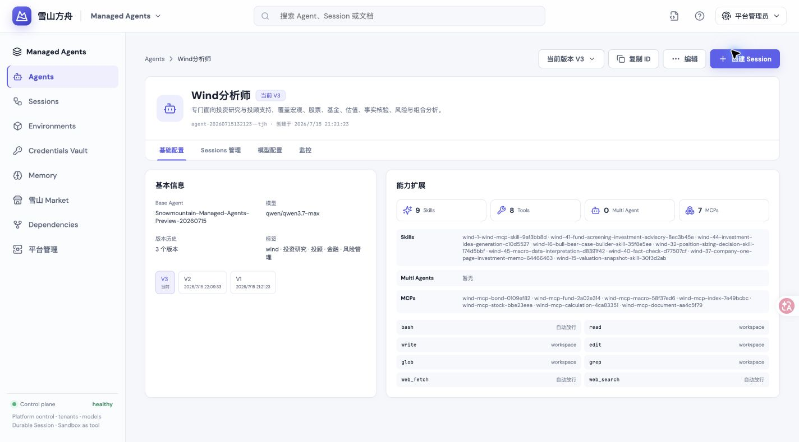
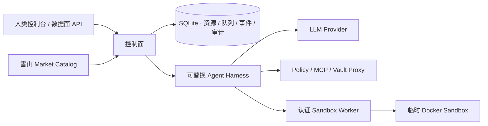
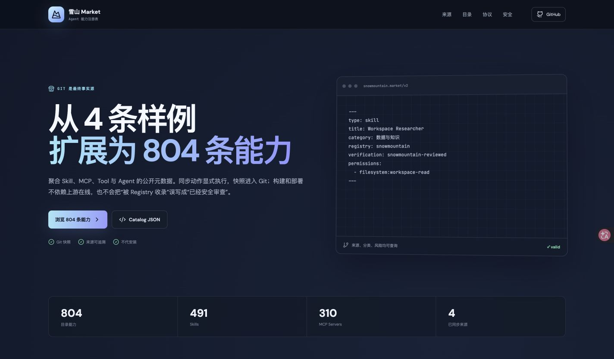

<div align="center">

# 雪山方舟 · Snowmountain Ark

**面向人类与 API 的 Managed Agents 中台**

把 Agent、模型、版本、Session、Sandbox、Memory、Vault 与能力市场组织成一套可运行、可观测、可替换的控制面。


[在线体验](https://sponsors-entered-solved-documentation.trycloudflare.com/ark/) · [雪山 Market](https://xiamu-ssr.github.io/snowmountain-market/) · [规范查看器](https://sponsors-entered-solved-documentation.trycloudflare.com/ark/specs)

</div>

[](https://sponsors-entered-solved-documentation.trycloudflare.com/ark/)

## 它解决什么

雪山方舟不是聊天壳，而是 Agent 的运行中台：管理员配置模型与 Runtime，用户组合 Prompt、Skills、Tools、MCP 和子 Agent；Session 只绑定 Agent，并始终跟随 Agent 的当前版本。每轮运行留下模型、Token、工具、策略和状态事件，既可在控制台调试，也可通过数据面 API 接入业务。

| 模块 | 职责 |
| --- | --- |
| Agents | 模型、Prompt、能力组合与不可变版本历史 |
| Sessions | 持久对话、任务队列、事件流、运行时间线与 Token 统计 |
| Environments / Sandbox | Session 工作区、资源限制与命令隔离 |
| Credentials Vault | 加密凭证、显式引用与 OAuth 刷新 |
| Memory | 与 Session 绑定的长期事实、偏好和研究记录 |
| 平台管理 | 租户、模型 Endpoint、模型目录、Runtime 与审计 |
| 雪山 Market | 从独立 Git-first 能力目录选择 Skill / MCP / Tool / Agent |

## 运行边界



- **Ark 不是 Git-first。** Agent、版本、Session、Memory、Vault 等运行事实存储在数据库中。
- **Market 是 Git-first。** 能力声明、版本、权限与安装说明以 Git 中的 Manifest / OKF 为事实源，再构建为静态站点和 HTTP Catalog。
- **Session 不固定 Agent Version。** 版本属于 Agent；Session 绑定 Agent，并在新一轮运行时解析当前版本。
- **Sandbox 是工具，不是 Agent 本体。** 命令进入隔离容器；模型、MCP 与凭证代理位于 Sandbox 外。

## 雪山 Market

[](https://xiamu-ssr.github.io/snowmountain-market/)

Market 当前汇聚 Skill 与 MCP 等能力，并保留来源、分类、标签、权限和安装说明。Ark 通过 Catalog Endpoint 消费市场数据，但不隐式安装第三方能力。

## 快速开始

需要 Node.js 24 与 pnpm 10；只有 Docker Sandbox 和生产拓扑要求 Docker。

```bash
pnpm install
pnpm spec:check
pnpm test
pnpm build
pnpm dev
```

- 控制台：`http://127.0.0.1:4311`
- API：`http://127.0.0.1:4310`
- 健康检查：`http://127.0.0.1:4310/health`

生产部署使用 [`deploy/docker-compose.prod.yml`](./deploy/docker-compose.prod.yml)，完整步骤见 [`deploy/README.md`](./deploy/README.md)。API 持有 Vault / 模型凭证但没有 Docker Socket；Worker 持有 Docker Socket，但只接收 Sandbox 与搜索所需配置。

## 模型与联网搜索

管理员在“平台管理”发布 OpenAI-compatible 模型 Endpoint，用户创建 Agent 时只选择模型和 Base Agent Runtime。联网搜索默认自动选择已配置 Provider：

```bash
WEB_SEARCH_PROVIDER=auto
TAVILY_API_KEY=...
FIRECRAWL_API_KEY=... # 可选回退
```

`auto` 优先使用 Tavily 的紧凑搜索结果；Tavily 故障且配置了 Firecrawl 时自动回退。Firecrawl 的开源 MCP 仍需要云端 API Key，并非匿名无限额度。

## Spec 与知识文档

- [`spec/contracts/`](./spec/contracts/)：介于意图与代码之间、可校验的 YAML DSL；生成 Viewer 的高密度数据源。
- [`docs/index.md`](./docs/index.md)：OKF bundle 入口，包含 Google OKF、Anthropic Managed Agents / Auto Mode / Containment 读书笔记与火山方舟反向工程。
- [`spec/README.md`](./spec/README.md)：Spec Profile、Schema、语义校验和生成方式。

核心约束由 `pnpm spec:check`、API/Worker 测试与 TypeScript 类型检查共同守护。当前仍是 beta：自研 Harness、Docker Sandbox 与 SQLite 适合单机验证；多节点调度、microVM 级隔离和生产级 Memory 自动提取仍在演进。
