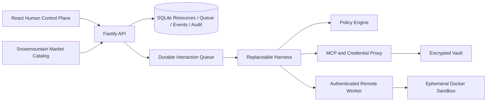

# 雪山方舟 · Snowmountain Ark

一个数据库驱动的 Managed Agents 完整中台：包含人类控制台、控制面 API、持久 Session、Harness、Sandbox、凭证代理、Memory、监控和外部数据面 API。产品交互借鉴火山方舟，并按 Anthropic 的 Managed Agents / Auto Mode / Containment 经验组织内部边界。

## 架构边界：Ark 不是 Git-first

- **雪山方舟不是 Git-first 系统。** Agent、版本、Session、事件、Environment、Credential、Memory 和 API Key 的事实源是运行中的数据库；Sandbox 工作区是 Session 的持久运行数据。
- **雪山 Market 才是 Git-first。** Market 的能力声明、版本、权限和安装说明以 Git 中的 OKF Markdown/Manifest 为事实源，构建后发布静态前端和 Catalog/Artifact HTTP endpoints。
- **OKF/SDD 是文档与对齐介质。** DSL 可以生成视图、校验和验收测试，但不会替代方舟数据库、状态机或运行时。

目前已具备：

- Agent 版本、模型、System Prompt、Skills、Tools、Multi Agents、MCPs 与工具级权限；
- Session、Environment、Credentials Vault、Memory Store 与依赖删除保护；
- SQLite 追加事件日志，逐项记录 User、Thinking、模型请求/Tokens、Policy、Approval、Tool/MCP/Subagent、Assistant 与状态；
- SQLite 持久 Interaction Queue：排队任务跨进程重启保留，运行中断会显式失败并可重试；
- 同一 Session 跨任务持久的 `/workspace`；
- 本地开发 Sandbox、Docker 硬隔离和独立的远程 Sandbox Worker；
- 登录 Session、HttpOnly Cookie、CSRF、防爆破限流和写操作审计；
- AES-256-GCM Credential Vault，以及 OAuth Client Credentials 自动换取/刷新；
- OpenAI-compatible 模型端点与本地确定性 Harness；
- 雪山 Market catalog 对接；
- React 人类控制台、预览/调试事件工作台、结构化 Inspector、API 接入、SDD 对齐页和依赖图。

## 架构



核心原则是：Session 是持久事件与状态，不是某个容器或模型上下文；Harness 和 Sandbox 都可以独立失败、恢复和替换。

生产拓扑刻意隔离两类高权限：API 持有 Vault/模型凭证但没有 Docker Socket；Worker 持有 Docker Socket 但没有 Vault/模型凭证。两者只通过随机共享 Token 的内部 HTTP 接口通信。

## 本地运行

要求 Node.js 24、pnpm 10。Docker 仅在启用 Docker Sandbox 时需要。

```bash
pnpm install
pnpm test
pnpm build
pnpm dev
```

- 控制台：`http://127.0.0.1:4311`
- API：`http://127.0.0.1:4310`
- 健康检查：`http://127.0.0.1:4310/health`

默认会读取已部署的 [雪山 Market Catalog](https://xiamu-ssr.github.io/snowmountain-market/api/catalog.json)。在相邻目录启动 Market 后，可以把 API 切到本地联调：

```bash
cd ../snowmountain-market
pnpm install
pnpm dev

cd ../XSEngine
MARKET_INDEX_URL=http://127.0.0.1:4320/api/catalog.json pnpm dev:api
```

线上 Catalog 默认地址：`https://xiamu-ssr.github.io/snowmountain-market/api/catalog.json`；只有显式设置 `MARKET_INDEX_URL` 时才切换到本地 Market。

## Sandbox

开发模式默认使用 `SANDBOX_DRIVER=local`，它只提供工作区边界校验，不是安全隔离。运行不可信模型代码时必须使用 Docker：

```bash
SANDBOX_DRIVER=docker SANDBOX_IMAGE=alpine:3.20 pnpm dev:api
```

Docker 驱动按工具调用启动可替换容器，默认：

- `--network none`
- read-only 根文件系统 + 64 MiB 临时 `/tmp`
- `cap-drop ALL`
- `no-new-privileges`
- CPU、内存与 PID 限制
- 只将当前 Session 工作区挂载为 `/workspace`

域名 allowlist 只用于代理化的 `web_fetch`，不会给 Sandbox 开放任意网络。

## 接真实模型

创建 Agent 时选择 `OpenAI-compatible`，填写模型 ID 和 Base URL；API Key 只通过服务端环境变量提供：

```bash
MODEL_API_KEY=... pnpm dev:api
```

Harness 支持标准 Chat Completions tool call 循环。生产版应把模型 Credential 也迁入 Vault/KMS，并由 provider proxy 按 Agent/Session 解析；不要把 key 写入 Agent Manifest、Environment 或工作区。

## API

控制面：

- `GET/POST /v1/agents`
- `PATCH /v1/agents/:id`（创建新版本）
- `GET /v1/agents/:id/versions`
- `GET/POST /v1/environments`
- `GET/POST /v1/vaults`
- `GET/POST /v1/credentials`
- `GET/POST /v1/memory-stores`
- `GET/POST /v1/sessions`
- `GET/POST/DELETE /v1/api-keys`
- `GET /v1/monitoring/summary`
- `GET /v1/settings`
- `GET /v1/audit`
- `GET /v1/auth/status`
- `POST /v1/auth/login`
- `POST /v1/auth/logout`

数据面：

- `POST /v1/sessions/:id/interactions`
- `GET /v1/interaction-jobs/:id`
- `GET /v1/sessions/:id/events?after=N`
- `GET /v1/sessions/:id/events/stream`（SSE）
- `POST /v1/sessions/:id/approvals/:approvalId`
- `POST /v1/sessions/:id/stop`
- `POST /v1/sessions/:id/sandbox/inspect`
- `POST /api/v1/sessions/:id/interactions`（Bearer API Key）
- `GET /api/v1/sessions/:id/events`（Bearer API Key）
- `GET /v1/dependencies`
- `GET /v1/market/catalog`

## 文档

[`docs/index.md`](./docs/index.md) 是 OKF bundle 入口，包含：

- Google OKF 理念与本项目使用方式；
- 三篇 Anthropic Engineering 文章的读书笔记、原链接和图示索引；
- 火山方舟逐页反向工程与真实 Session 探针；
- 用户长对话的逐字原始文件、结构化 Markdown 和独立理解。

## 安全边界

- Vault 使用 AES-256-GCM；未设置 `VAULT_MASTER_KEY` 时的开发默认密钥不得用于生产。
- Credential API 永不返回明文。
- 资源被 Session/Agent 引用时删除返回 `409 resource_in_use`。
- Shell 确定性规则先阻断强推、管道下载执行、系统持久化等高风险动作。
- 模型分类器未来只能作为纵深防御，不能替代环境隔离、出口控制和凭证代理。
- 本地/远程 Market 来源必须固定版本、验证 SHA-256 并审查权限。

## Docker Compose

```bash
docker compose up --build
```

Compose 便于演示控制面，默认仍使用本地执行驱动。生产运行不可信代码时，应把 Sandbox Worker 独立部署到容器平台或 microVM，不要把宿主机 Docker socket 直接暴露给 API 服务。

生产部署使用 [`deploy/docker-compose.prod.yml`](./deploy/docker-compose.prod.yml)：API 与 Worker 分离、只公开 loopback Web 端口，再由宿主 Nginx 提供 HTTPS `/ark/`。完整运维步骤、IP 短证书自动续期、备份与恢复见 [`deploy/README.md`](./deploy/README.md)。
