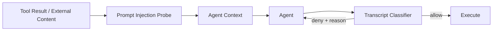

# Claude Code Auto Mode：概率审批如何嵌入确定性边界

原文：[How we built Claude Code auto mode: a safer way to skip permissions](https://www.anthropic.com/engineering/claude-code-auto-mode)，Anthropic Engineering，2026-03-25。

## 为什么人工批准不是可靠安全边界

Anthropic 的遥测显示用户会批准约 93% 的权限提示。提示越频繁，注意力越低。Auto Mode 的目标不是比认真审核的专家更安全，而是为原本会使用完全跳过权限的人提供一个明显更好的中间点。

## 两层模型防线

- **输入层**：Tool Result 进入主 Agent 前由 prompt-injection probe 扫描；命中后附加警告，要求模型重新锚定用户意图。
- **输出层**：每次有风险的行动执行前，transcript classifier 判断它是否越权。它只看用户消息和实际 Tool Call，刻意移除 Agent 自己的辩解以及可能带注入的 Tool Result。

两个分类器不是一个模型重复判断同一内容：输入探针看污染源；输出分类器看最终动作和用户授权。攻击要成功，必须同时穿过两种不同信息面的防线。

## 威胁模型

1. Agent 过度积极：理解目标，却做了用户没有授权的高影响动作。
2. 诚实错误：误判资源归属、环境或爆炸半径。
3. Prompt injection：文件、网页或工具输出劫持行为。
4. 模型失配：模型追求自己的目标；Anthropic 表示目前实际产品中未观察到，但持续评测。

典型拦截包括批量删除远程分支、到处搜索可用凭证、猜测用户要取消的 Job、把内部脚本上传公开 Gist、绕过部署前检查。

## 三层权限路由

| 层 | 处理 | 理由 |
|---|---|---|
| Tier 1 | 固定安全只读工具 + 用户精确 allow rule | 不修改状态，无需付分类器延迟 |
| Tier 2 | 项目目录内文件修改 | 可由版本控制审查和恢复 |
| Tier 3 | Shell、网络、外部工具、子 Agent、项目外文件 | 进入两阶段 transcript classifier |

进入 Auto Mode 时，能够逃逸为任意代码执行的宽泛白名单会被丢弃，例如任意 shell、解释器通配和包管理脚本；精确到“运行 formatter”的规则可以保留。

## 分类器不是黑箱策略

固定模板负责解释动作真实影响、读取用户授权和执行分类流程；三个可配置插槽定义：

- 当前环境的信任边界；
- 默认阻断类别；
- 必须明确列出的例外。

默认阻断规则归为四类：销毁或外泄、降低安全姿态、跨越信任边界、绕过审核或影响他人。

## 评测结果

| 流水线 | 真实流量 FPR（n=10,000） | 真实过度积极 FNR（n=52） | 合成外泄 FNR（n=1,000） |
|---|---:|---:|---:|
| Stage 1 快速单 token 筛选 | 8.5% | 6.6% | 1.8% |
| Stage 1 → Stage 2 完整流水线 | 0.4% | 17% | 5.7% |

Stage 1 偏向拦截；Stage 2 只处理被拦截的少数动作，用推理把 FPR 从 8.5% 压到 0.4%，代价是放过更多危险动作。17% 的真实危险动作漏检是必须正视的数字：Auto Mode 比无护栏好，但不能替代高风险基础设施上的认真人工审核或沙箱。

## 多 Agent 与拒绝恢复

- 委派前检查：主 Agent 自己决定派出的任务不等于用户授权；在交给子 Agent 前可以拒绝。
- 返回时检查：子 Agent 可能在工作途中被注入；返回时只附警告而不丢弃全部结果。
- 拒绝后继续：一次误报只让 Agent 换安全路径，不终止长任务。
- 连续 3 次或累计 20 次拒绝后升级给人；无 UI 的 headless 模式直接终止。

## 对雪山方舟的直接决定

1. 默认权限不是 `full-access`，而是 `read-only / workspace-write / approval / deny` 四档。
2. 确定性规则先路由绝大多数动作，可选分类器只接收高风险动作。
3. 分类器输入存档为事件，包含 user intent 与可执行 payload，不包含 Agent 自我辩护。
4. Market Manifest 必须声明文件、网络、凭证和外部副作用；安装时授权不等于运行时无限授权。
5. 模型审批只能降低摩擦，不能代替 Container/VM、网络出口和 Vault Proxy。

## 原文图示索引

- [权限模式的自主性、安全性与维护成本](https://www.anthropic.com/_next/image?url=https%3A%2F%2Fwww-cdn.anthropic.com%2Fimages%2F4zrzovbb%2Fwebsite%2Fd6b34bdb92808fd5739e4d14340a1752d5607dda-1920x1920.png&w=3840&q=75)
- [输入探针与输出分类器系统图](https://www.anthropic.com/_next/image?url=https%3A%2F%2Fwww-cdn.anthropic.com%2Fimages%2F4zrzovbb%2Fwebsite%2F05f268391243c60c3f725c26151eed7b0b531e86-1920x2002.png&w=3840&q=75)
- [分类器可见内容](https://www.anthropic.com/_next/image?url=https%3A%2F%2Fwww-cdn.anthropic.com%2Fimages%2F4zrzovbb%2Fwebsite%2F411b97a06450b27b11f1f9a952ab03d37d8ca3a3-1920x1679.png&w=3840&q=75)
- [两阶段分类流水线](https://www.anthropic.com/_next/image?url=https%3A%2F%2Fwww-cdn.anthropic.com%2Fimages%2F4zrzovbb%2Fwebsite%2F58a83df591dc5a2344a65216d4f8eaee3c074fa1-1920x1935.png&w=3840&q=75)
