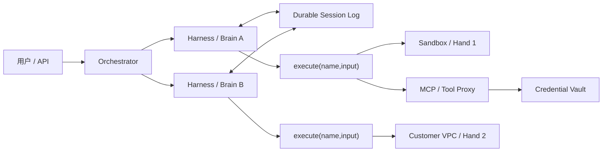

# Managed Agents：把大脑、双手和历史分开

原文：[Scaling Managed Agents: Decoupling the brain from the hands](https://www.anthropic.com/engineering/managed-agents)，Anthropic Engineering，2026-04-08。

> 本笔记只保留极短引文、结构化摘要和我的理解；完整原文与版权归 Anthropic。原文插图链接列在文末，没有镜像到仓库。

## 核心问题不是“怎么写一个更聪明的循环”

Harness 会把“模型目前做不到什么”编码成控制逻辑，但模型快速进步后，这些假设会过期。Anthropic 的例子是早期模型接近上下文上限时会提前收尾，Harness 因此加入 context reset；换成更强模型后，这段逻辑反而成了负担。

Managed Agents 因而不是某一个固定 Harness，而是 **meta-harness**：固定外部接口，让 Session、Harness 和 Sandbox 的内部实现可以替换。

## 三个稳定抽象

| 抽象 | 定义 | 关键性质 |
|---|---|---|
| Session | 发生过的一切的追加事件日志 | 持久、可切片读取、可回放，不依赖某次 Harness |
| Harness | 调模型、组织上下文、路由工具的循环 | 无状态/可恢复、可按模型和任务替换 |
| Sandbox | 执行代码和编辑文件的环境 | 可销毁、可重建、凭证不可达 |

原文给出的接口形状非常小：`execute(name, input) → string`、`provision({resources})`、`wake(sessionId)`、`getSession(id)`、`emitEvent(id,event)`、`getEvents()`。重要的不是名字，而是失败域：容器死了只产生一次工具错误；Harness 死了由另一个 Harness 从事件日志恢复；Session 不跟着两者死亡。

## 为什么“一容器装全部”会失败

早期设计把事件、Harness、工作区和凭证都放进一个容器，短期很简单，但它很快变成不可替换的“宠物”：

- 容器故障等于 Session 丢失；
- WebSocket 断流、Harness bug、容器离线在外部表现相同；
- 为排障进入容器会碰到用户数据；
- Harness 默认资源和自己在同一网络，难以接客户 VPC；
- 未使用沙箱的请求也必须等待容器启动，拖累首 token 延迟。

解耦并改成按需 provision 后，Anthropic 报告 p50 TTFT 约下降 60%，p95 下降超过 90%。

## Session 不是上下文窗口

上下文压缩与裁剪都是不可逆选择：今天被认为无关的事件，未来可能正是排障证据。原文把 Session 当成模型窗口外的“上下文对象”：完整事件持久保存，Harness 通过位置切片选择给模型哪些事件，并可按模型特性自由压缩、缓存或重排。

这意味着：

- **事实层**是不可变事件；
- **上下文层**是某个 Harness 对事实的暂时投影；
- compaction 结果可以缓存，但不能覆盖原事件；
- 长任务恢复依赖事件游标，而非模型自述“我做到哪了”。

## 凭证边界

凭证既不能进入 Sandbox，也不应进入 Harness：

- Git token 在初始化资源时用于 clone/配置 remote，Agent 可 push/pull，但拿不到 token 文本；
- MCP OAuth token 留在 Vault，工具调用走专用代理；代理根据 Session token 取对应凭证并代发请求。

这是结构性保证，比“请模型不要读取环境变量”可靠得多。

## 对雪山方舟的直接决定

1. `SessionEvent` 采用追加写，状态由事件归约；运行中快照只是缓存。
2. Harness worker 不保存唯一状态，任何 worker 都能 `wake(sessionId)`。
3. Sandbox 实例不作为 Session 本身；工作区卷可以按 Session 持久化，计算容器可替换。
4. 内置 Tool、MCP、客户 VPC、手机或模拟器都实现统一的 Execution Target 接口。
5. Vault 只向 Tool Proxy 暴露短期、按 Session 和目标缩权的 token。
6. 多 Agent 是多个 brain 共享或移交 hand 的调度问题，不把子 Agent 当成更高信任来源。

## 原文图示索引

- [Managed Agents 三抽象总览](https://www.anthropic.com/_next/image?url=https%3A%2F%2Fwww-cdn.anthropic.com%2Fimages%2F4zrzovbb%2Fwebsite%2F903b624ada206b10753a24c6a1367e74a869165d-1080x1080.png&w=3840&q=75)
- [脑、手、Session 解耦图](https://www.anthropic.com/_next/image?url=https%3A%2F%2Fwww-cdn.anthropic.com%2Fimages%2F4zrzovbb%2Fwebsite%2F73e900af5b9d6ed8c64db0a8e74d4465963556b7-1640x1596.png&w=3840&q=75)
- [Session 作为窗口外上下文对象](https://www.anthropic.com/_next/image?url=https%3A%2F%2Fwww-cdn.anthropic.com%2Fimages%2F4zrzovbb%2Fwebsite%2Fcf0719d7832b1f577b7393c84a7c53eecc725ca4-760x200.png&w=1920&q=75)
- [Many brains, many hands](https://www.anthropic.com/_next/image?url=https%3A%2F%2Fwww-cdn.anthropic.com%2Fimages%2F4zrzovbb%2Fwebsite%2F4f67b1c10566552aec514a716ea43544ab330e0b-668x243.png&w=1920&q=75)
