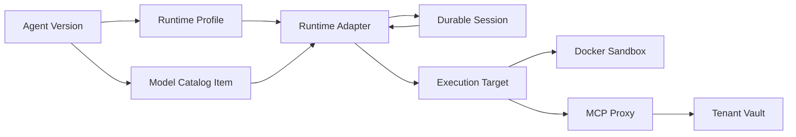

# Base Agent Runtime 与平台控制面的职责

## 观察与推断要分开

2026-07-15 的火山方舟 Beta 现场观察显示：Agent 创建页先选模型、Prompt 和能力，最后在高级参数显示唯一的 `Ark-Managed-Agents-Preview-20260601` Base Agent。页面没有公开它的内部实现，因此“Base Agent 就是 Runtime”仍是推断；但这个推断与 Anthropic 的 Harness 定义以及火山引擎 AgentKit 的“动态 Harness 编排”描述一致。

参考：

- [Anthropic：Scaling Managed Agents](https://www.anthropic.com/engineering/managed-agents)
- [火山方舟 Managed Agents 控制台教程](https://www.volcengine.com/docs/82379/2553715?lang=zh)
- [火山引擎 AgentKit](https://www.volcengine.com/product/agentkit)

## Runtime 不是模型，也不是 Sandbox

模型提供下一步推理；Sandbox/MCP/Tool 是可执行的“手”；Runtime/Harness 是把两者连接成可恢复任务的循环。一个可进入 Managed Agents 的 Runtime 至少需要：

1. 把 Session 事件投影成模型上下文，并支持截断、compaction、Prompt Cache 和恢复游标；
2. 调用模型，解析 Tool Call，限制循环次数并处理 stop/cancel/timeout；
3. 把内置 Tool、MCP 与子 Agent 统一成带来源和 Policy 的能力目录；
4. 在执行前做确定性 Policy/审批，在结果进入上下文前保留输入探针扩展点；
5. 通过 `provision/execute/destroy` 使用 Sandbox，而不是拥有 Sandbox 生命周期；
6. 通过 Vault/MCP Proxy 使用凭证，Runtime 和模型上下文不得获得明文；
7. 把 thinking、模型请求、Tool、审批、错误、Token、成本和状态写回追加事件流；
8. Harness 崩溃后能由新实例从 Session 事件恢复，避免把进程内内存当唯一事实；
9. 固定 Runtime Profile 版本，使旧 Session 可重放，新 Runtime 可灰度；
10. 为 Multi-Agent 定义委派、返回、预算、信任和递归上限。

## Runtime 怎样融入方舟

雪山方舟不让某个 SDK 拥有 Session、Vault 或 Sandbox。`RuntimeProfile` 是管理员发布的版本化能力说明，Agent Version 固定其 ID；调度器根据 Profile 选择 Adapter。当前只有 `snowmountain-harness`，但外部接口预留给 Claude Agent SDK、OpenCode 或任务专用 Harness：它们消费同一 Session/Event/Execution Target 接口，不能绕过 Policy 与 Vault。

## 为什么模型接入属于管理员

普通用户选择“可用模型”，不应该拿到 Provider Base URL、平台 API Key、配额或供应商路由规则。管理员负责：Endpoint、密钥、模型目录、价格、RPM/TPM、可见性和健康检查；Agent 作者只保存 `endpointId + modelId`。这和火山方舟模型选择器的产品边界一致，也让更换供应商路由无需修改每个 Agent。

## 租户边界

平台管理员与普通用户使用不同能力面。普通用户的 Agent、Session、Environment、Vault、Credential、Memory 与 API Key 都带 `tenantId`，API 在列表、单项读取、关联校验、删除和 Session 事件上执行同一租户过滤。管理员可以跨租户运维模型/Runtime 和审计，但平台模型密钥不进入任何租户 Vault。
