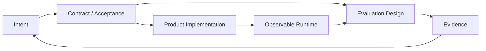

# 从对抗基模到设计收敛系统

原文：[结构化对话全文](../sources/conversations/opus46-sdd-dialogue.md)；[逐字原始粘贴](../sources/conversations/opus46-sdd-dialogue.raw.txt)。

## 我认为这场对话真正完成了什么

表面主题从 Opus 4.6、SDD、SpecReview、DSL 一路跳到软硬件 AI 评测和 OKF；底层其实只围绕一个问题：**当模型越来越强，人还应该把价值放在哪里？**

对话开头的焦虑来自“我过去的产品价值建立在模型不够强”；后面的推理逐渐把价值从补模型短板，迁移到四个不会被一次模型升级吞掉的位置：

1. 给模型正确、可追溯的上下文；
2. 给模型能行动、但有硬边界的环境；
3. 把意图变成可验证的契约与评测；
4. 让失败能够被事件、回放、测试和观测收敛。

这与 Managed Agents 的结论一致：Harness 的聪明技巧会过期，稳定的 Session、Sandbox、Tool、Vault 和 Evaluation 接口更长寿。

## 三层概念终于被分开

| 层 | 工件 | 回答的问题 |
|---|---|---|
| 知识层 | OKF / Markdown concept | Agent 需要知道什么背景？ |
| 契约层 | Manifest、状态机、Schema、验收条件 | 哪些行为不能靠猜？ |
| 运行与评测层 | 事件、测试、设备探针、指标 | 实际发生了什么，是否满足意图？ |

主流 Markdown SDD 的危险不是“文本低级”，而是一份自然语言同时承担动机、事实、状态、权限和验收。最实用的改进不是先发明一门能描述世界的 DSL，而是按风险逐步硬化：身份、枚举、权限、状态转移和外部副作用进结构化契约；实现细节保留给模型；结果由事件与评测收敛。

## 关于“一种 DSL”的结论

用户反复拒绝“每个问题一种 DSL”，这个拒绝是对的。另一位 Agent 最后给出的 YAML `paragraph/main/branches/写入/后续` 很有启发，但必须区分两件事：

- 从截图推测出的“原作者只有这些原语”并没有得到原作者 Schema 或源码验证；
- YAML 只是宿主语法，真正的 DSL 是字段语义、引用规则、校验器和版本兼容策略。

因此雪山项目不会把这套推测的业务 DSL 当成基础依赖。我们只统一 **Agent Capability Manifest**：Agent、Skill、MCP、Tool、Environment、Credential、Memory 的可执行关系。业务团队将来需要状态机或评测 DSL 时，可以作为 Market 中的 Skill/Tool 接入，而不是写死在平台核心。

## Spec 与 Eval 不是先后关系

对话里一度把 EDD 理解成“产品做完以后再评测”。更准确的工程关系是：

评测执行确实需要产品存在，但可观测点、后门协议、设备账号、日志结构和验收指标必须在实现前进入契约，否则“产品完成后再接评测”通常只得到昂贵且不完整的黑盒测试。

对软硬件 AI 产品，权重会向端到端效果、硬件指标与真实环境偏移，但 SDD 没有消失：评测 API、设备状态、外部平台错误码和安全拦截本身都需要精确契约。

## 对另一位 Agent 回答的必要纠偏

1. 人类“裸写 70 分”、成熟流程“95+ 分”等数字在原对话中没有可靠量纲和来源，只能当比喻，不能做产品指标。
2. “原作者截图证明 DSL 能自动生成全部视图和测试”属于合理猜测，不是已验证事实。
3. Mermaid 是优秀投影格式，但不适合作为需要强校验的唯一事实源；同样，生成后的 Mermaid 不应反写进手工 Markdown 形成双事实源。
4. Contract Test 不只等于 HTTP mock；数据库、RPC、消息队列和设备协议需要各自的可执行 provider/consumer 验证或仿真层。
5. PRE 能避免真实客户损失，却不能自动解决测试数据、供应商计费、不可逆外部副作用和硬件安全问题。

## 给雪山方舟的产品翻译

- OKF 把知识放在 Git，Market 让能力可发现、可校验、可下载。
- Manifest 把“AI 猜错但看起来合理”的地方结构化：权限、目标、版本、哈希、凭证引用、网络能力和依赖。
- Session 追加事件把模型行为变成证据，不把最终回答当唯一真相。
- Environment 与 Sandbox 把评测、依赖和运行边界前置。
- Memory 是跨 Session 的显式资源，不和完整 Session event log 混为一谈。
- Evaluator/Verifier 是一种 Agent 或 Tool，但验证结论必须引用确定性证据。

## 最终理解

基础模型变强并没有让应用层价值消失，而是让价值从“替模型规划”转向“管理它的现实接触面”。模型负责越来越大的自由度；平台负责让这种自由度有上下文、有能力边界、有事件记录、有证据链，并在失败后可恢复。这比再造一个固定 Workflow 更难，也更不容易被下一代模型吞掉。
