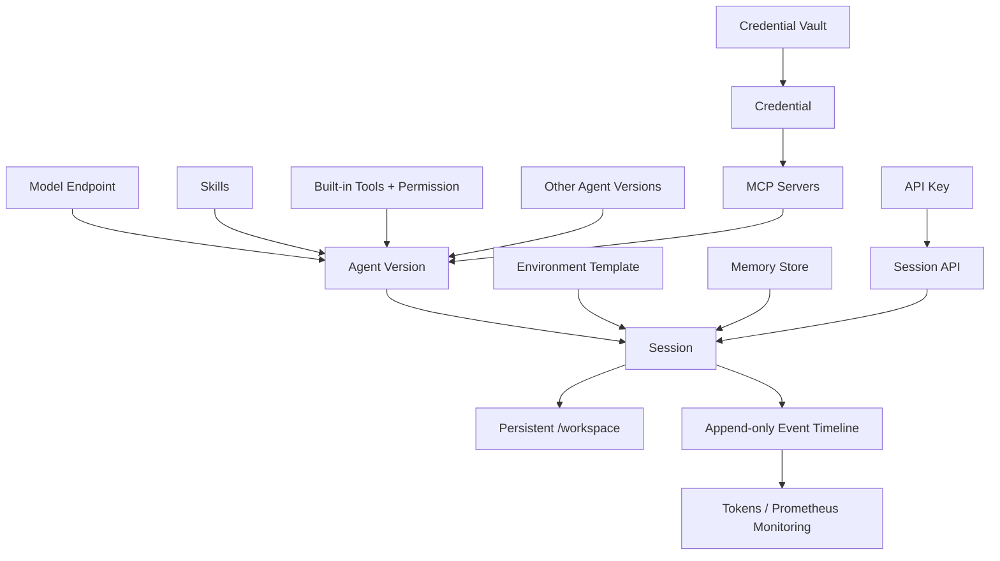

# 火山方舟 Managed Agents 反向工程记录

本记录来自 2026-07-13 至 2026-07-14 对已登录火山方舟 Beta 控制台的逐页检查，以及用户明确授权的低成本 Session 沙箱探针。标记为“观察”的内容来自 UI 或事件流；标记为“推断”的内容是产品设计解释。

## 一级资源

| 资源 | UI 定义 | 核心字段/能力 |
|---|---|---|
| Agent | 定制模型、Prompt 与能力的版本化配置 | 名称、描述、模型、System Prompt、Skills、Tools、Multi Agents、MCPs、Base Agent、标签 |
| Session | 交互测试和外部 API 的运行实例 | 名称、Agent、Environment、资源配置、状态、事件、Tokens、预览/调试模式 |
| Environment | Agent 运行环境模板 | 名称、描述、预装包、环境变量；创建 Session 时绑定 |
| Credentials Vault | MCP 与 Skill ENV 的凭证托管 | Vault → Credential；Bearer/OAuth；明文保存后不可再次查看 |
| Memory Store | 跨 Session 持久记忆 | 名称、描述、Memory 条目；创建 Session 时绑定/读取 |

## 依赖关系

推断：Agent 是控制面模板，Session 是数据面和生命周期边界；Environment 在 Session 创建时实例化为工作区/沙箱；Memory Store 是显式跨 Session 知识，而 Session 工作区在同一 Session 内跨任务持久。

## Agent 创建页

1. 基础信息：名称必填，描述 300 字。
2. 模型配置：支持语言和视觉模型。
3. System Prompt：上限 10,000 字。
4. 能力扩展：Skills、Tools、Multi Agents、MCPs 四个并列入口。
5. 高级参数：Base Agent、最多 20 个标签、批量添加、费用预估。

内置 Tools 观察到：`bash`、`read`、`write`、`edit`、`glob`、`grep`、`web_fetch`、`web_search`。每项可启停，并在“完全访问 / 请求批准”之间选择。现有 Agent 详情显示 `当前版本：V1`，说明编辑需要版本语义，而不是直接覆盖正在被 Session 使用的配置。

Agent 详情包含基础配置、Sessions 管理、模型配置和监控。模型页展示 endpoint、RPM/TPM、缓存与非缓存输入价格、输出价格。监控接入托管 Prometheus，默认保留近 15 天数据。

### 2026-07-15 模型、Base Agent 与 Vault 复核

- 模型不要求用户填写 Provider URL 或 API Key，而是从火山方舟账号已经开通的模型目录选择。现场观察到 `Doubao-Seed-Evolving`、`Doubao-Seed-2.1-turbo`、`GLM-5.2`、`DeepSeek-V4-pro`、`Doubao-Seed-2.1-pro`，并在右侧选择模型版本。这说明模型供应商接入属于平台/管理员控制面，Agent 作者只固化模型引用。
- 高级参数只显示一个 `Ark-Managed-Agents-Preview-20260601 · 默认`。结合它位于模型、Prompt、Tool 之外，以及 AgentKit 对“动态 Harness 编排”的公开描述，合理推断 Base Agent 是版本化 Harness/Runtime Profile，而不是另一个业务 Agent。它决定 Agent loop、上下文、Tool 路由、恢复和安全策略的实现版本。
- Vault 列表页原文是“为 MCP Server 与 Skill ENV 集中托管登录凭证。Agent 只引用名称，方舟代理层动态注入”。因此 Vault 在账号/租户内是可发现的共享资源池，但 Credential 并非自动注入每个 Session；实际使用仍发生在 MCP 或 Skill ENV binding。火山方舟自有模型不经过这个 Vault，因为模型供应商凭证由平台托管。

参考：[Managed Agents 控制台教程](https://www.volcengine.com/docs/82379/2553715?lang=zh)、[火山引擎 AgentKit](https://www.volcengine.com/product/agentkit)。后者公开描述了动态 Harness、Session 内模型/Tool/Skill 热切换、长任务中断恢复、MCP 网关、身份与安全沙箱等能力；它不是本 Beta 私有实现的源码证明，只能作为同一厂商的产品方向证据。

## Environment 创建页

- 名称；
- 可选描述；
- 预装包（可添加多项）；
- 环境变量（可添加多项）。

列表显示关联 Session 数量，说明被引用 Environment 不应被无检查删除。平台文案明确“Agent 创建时绑定”，实际 Session 创建表单又要求 Environment，合理解释是 Agent/快捷创建可以预选，最终绑定落在 Session。

## Vault 与 Credential

Vault 创建时只填名称；进入详情后添加 Credential：

- 名称（建议 kebab-case）；
- MCP Server；
- Bearer Token 或 OAuth；
- Token/Client 凭据在保存前校验；
- 保存后明文不可查看，修改必须重填；
- 列表记录 MCP Server URL、鉴权方式和更新时间。

平台文案明确：Agent 只引用名称，代理层动态注入，明文不进入模型上下文，OAuth 自动 refresh，所有操作有审计。这和 Anthropic 的 Vault Proxy 设计高度一致。

## Memory Store

创建字段是名称、描述和初始 Memory。列表展示关联 Session、Memory 数量和存储用量。UI 示例强调“写组件前先查阅本库”，表明它更像可检索的长期知识，而不是 Session 完整事件日志。

## Session 与 API

创建字段：名称、Agent、Environment、资源配置。列表有运行状态、Agent、Environment、创建/更新时间、API 接入。

Session 详情同时是调试台：

- `预览模式 / 调试模式`；
- `时间线 / Tokens`；
- User、Thinking、Tool Use、Tool Result、Agent、Idle 等事件逐项展示；
- 输入/输出 token 累计；
- 空闲时可继续分配任务，运行中可终止；
- API 接入向导先选择/创建 API Key，再复制示例代码。

### 2026-07-14 二次核验补充

- 调试模式不会只改变配色，而是切换到原始事件协议视图。实际观察到 `span.model_request_start`、`span.model_request_end`、`agent.thinking`、`agent.tool_use`、`agent.tool_result`、`agent.message`、`session.thread_status_running/idle` 与 `session.status_running/idle`。
- 每个 `model_request_end` 都显示独立 Token 账单，例如 `10,208 input -> 312 output · 9,984 cache read · 0 cache write`。所以 Tokens 页必须基于逐请求 usage 事件生成，不能只画累计总数。
- 预览模式将同一原始协议投影为 User、Agent、Thinking、Tool Use、Tool Result、Idle 等人类可读时间线。预览和调试是同一事件源的两种 projection。
- Multi Agents 最多添加 20 个；UI 明确提示“已是 Multi-Agent 的不可作为 subagent”，这是为了阻止无界嵌套和权限/成本爆炸。
- MCP 添加器有“预置 / 手动输入”两个投影。手动输入字段是名称、URL、调用策略和操作，最多 20 个；调用策略仍是“完全访问 / 请求批准”。
- Credential 的 MCP Server 既可从预置服务选择，也可填写自定义名称和 URL。OAuth 表单分为可选 Access Token 与可选 Client ID / Client secret，随后进入 MCP 授权流程。
- API 接入是两步向导：获取/创建 API Key，再复制当前 Session 的示例代码。API 操作的仍是与控制台相同的 Session 和事件数据面。
- 2026-07-15 用户实测纠正了此前推断：Agent 顶部存在“当前版本”选择器，版本历史同时区分 `Latest` 与 `当前`；Session 只绑定 Agent。运行版本由 Agent 的当前版本统一决定，而不是由每个 Session 单独固定。Session 事件仍应记录每轮实际解析到的版本，供回放与审计。

## 真实探针

在现有 Session `sesn-20260713153037-6klml` 中发送了一个明确禁止网络和凭证访问的任务：

1. `bash` 执行 `pwd`，结果 `/workspace`，退出码 0，耗时 2ms；
2. `write` 创建 `/workspace/runtime-probe.txt`，写入 `snowmountain-ark-managed-agent-probe`，36 bytes；
3. `read` 读取同一文件，内容匹配；
4. Session 回到 Idle；
5. 下一任务只调用 `read`，文件仍存在且内容一致。

结论：

- 工作区对同一 Session 的多个任务持久；
- 工具参数和结果以结构化事件保存；
- Session 是运行、工作区、Token 统计和事件回放的共同边界；
- 模型回答“文件会持久”不是证据，第二个任务的实际 `read` 事件才是证据。

## 值得照抄的 UI 反馈

- 左侧资源导航稳定，页面首屏先解释资源用途，再提供搜索、创建和表格。
- ID 与人类名称并列；关联资源可跳转；危险操作集中在最右列。
- 创建 Agent 使用编号段落 `01–05`，复杂度按基础→模型→Prompt→能力→高级递进。
- Tool 权限紧贴 Tool 展示，不藏在全局安全页。
- Session 时间线把模型思考、调用、结果、空闲状态统一到一种事件视图。
- API 不是独立产品，而是同一 Session 的另一个入口。

## 需要改进的点

- 能力扩展的“添加”入口在空状态中语义不明显，Market 应提供搜索、来源、权限和版本信息。
- Tool 只有“完全访问 / 请求批准”过粗；雪山方舟增加只读、工作区写、拒绝和策略分类器。
- Environment 中普通环境变量与秘密变量容易混淆；秘密只能引用 Vault。
- 监控依赖外部 Prometheus 服务，雪山方舟本地版应自带基础 OTLP 事件导出和最小指标页。
